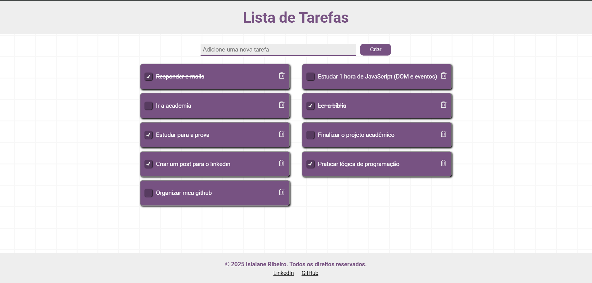
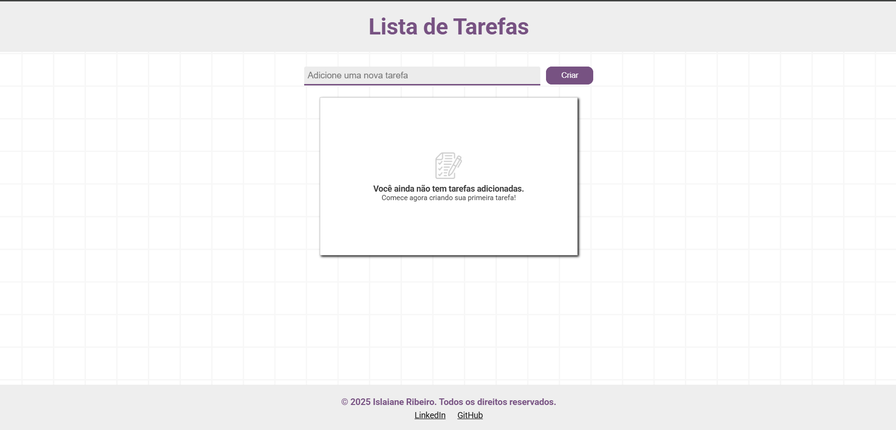

# ✅ Lista de Tarefas

Este é um projeto simples e funcional de **Lista de Tarefas**, desenvolvido para praticar lógica de programação, manipulação do DOM e uso do **localStorage** com **HTML, CSS e JavaScript** puros. A aplicação permite ao usuário adicionar, concluir e excluir tarefas, mantendo os dados salvos mesmo após atualizar ou fechar o navegador.

<div align="center">
  
  
  
</div>

🔗 Acesse o projeto online: [Link do Projeto](https://lista-de-tarefas-islaianeribeiro.netlify.app/)

## 🚀 Tecnologias Utilizadas

- **HTML5** – Estrutura semântica e acessível da página.
- **CSS3** – Estilização moderna e responsiva.
- **JavaScript** – Manipulação dinâmica da lista de tarefas e persistência de dados.
- **localStorage** – Armazenamento persistente no navegador.

## 📌 Funcionalidades

- ✅ Adicionar novas tarefas
- ☑️ Marcar tarefas como concluídas (com linha cortada)
- 🗑️ Excluir tarefas da lista
- 💾 Salvamento automático no localStorage
- 📭 Mensagem personalizada quando não houver tarefas cadastradas
- 💡 Validação de entrada (mínimo de 3 caracteres)
- 📱 Responsividade: visualização adaptada para dispositivos móveis

## 🧠 Organização do Código

```
📁 src
├─ 📁 images            # Imagens usadas na interface (ícones, ilustrações)
├─ 📁 javascript        # Arquivo principal com toda a lógica JS
│  └─ script.js
├─ 📁 styles            # Estilizações em CSS puro
│  └─ styles.css
└─ index.html           # Estrutura principal da aplicação
```

## 🛠️ Como Usar

1. Clone este repositório:

   ```bash
   git clone https://github.com/islaianeribeiro/todo-list.git
   ```

2. Acesse a pasta do projeto:

   ```bash
   cd todo-list
   ```

3. Abra o arquivo `index.html` no navegador (não precisa de servidor).

   Ou, se preferir, use uma extensão como Live Server no VSCode.

---

## 💡 Melhorias Futuras

- [ ] Adicionar opção para editar tarefas
- [ ] Filtrar tarefas por status (todas / concluídas / pendentes)
- [ ] Adicionar animações suaves ao adicionar ou remover tarefas
- [ ] Tema escuro (dark mode)
- [ ] Utilizar SVG inline ou bibliotecas de ícones externas para melhorar performance e personalização

---

## 👩‍💻 Desenvolvido por

**Islaiane Ribeiro**
Front-End Developer

🔗 [https://www.linkedin.com/in/islaianeribeiro](https://www.linkedin.com/in/islaianeribeiro)

---

## 📝 Licença

MIT © 2025 — Sinta-se à vontade para usar como base para seus próprios projetos!
